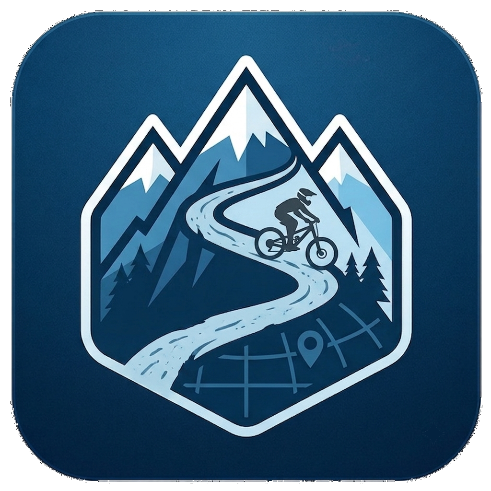

<div align="center">
  
  <h1>Alpine MTB Map</h1>
  <p>Mountain biking spots across the Alps & beyond, all in one KML file.</p>
</div>

- **Map:** [vemonet.github.io/alpine-mtb-map](https://vemonet.github.io/alpine-mtb-map)
- **Data:** [`public/alpine-mtb-map.kml`](public/alpine-mtb-map.kml) · the single source of truth
- **Direct downloads:** [KML](https://vemonet.github.io/alpine-mtb-map/alpine-mtb-map.kml) · [GPX](https://vemonet.github.io/alpine-mtb-map/alpine-mtb-map.gpx) · [GeoJSON](https://vemonet.github.io/alpine-mtb-map/alpine-mtb-map.geojson)

## Why

This project comes out of the frustration of trying to find a good mountain biking spot. You end up going through a dozen different sites, and none of them give you the whole picture: what the trails are actually like, what the lift costs, how long it takes to get there. There is no decent overall map with the information you need to plan a trip. And once you have finally settled on a spot, finding a KML or GPX to load into your GPS app is its own hunt.

Alpine MTB Map fixes that. The spots live in one KML you download and open in [CoMaps](https://www.comaps.app/), [Organic Maps](https://organicmaps.app/) or OsmAnd, and the website is a convenience layer on top: browse and filter the same file from the web, no app required.

For each spot you get:

- what the **trails** are like, and how many there are
- how you **get up** and what the day pass costs, plus season dates and whether the [Magic Pass](https://www.magicpass.ch) covers it
- an **Access** table: travel time from the city a rider would realistically start from
- **tags** you can filter on: difficulty, winter riding, Magic Pass, price
- **trail lines** where [OpenStreetMap](https://openstreetmap.org) has the geometry, and **extra waypoints** where they help: valley stations, mid-stations, trailheads, lift hubs

A good spot here means at least one singletrack where mountain biking is allowed. Most also have a way to get from the bottom to the top that is not your legs (funicular, cog railway, gondola, cable car). Purpose-built bike parks are blue, natural lift-served spots are dark green, and a handful of natural no-lift spots are kept in brown.

## Contributing

Contributions are very welcome, especially new spots and price corrections.

Add yours to [`public/alpine-mtb-map.kml`](public/alpine-mtb-map.kml) following [Adding a point](#adding-a-point) below, check it renders:

```bash
npm install -g vite-plus   # the toolchain, once per machine
vp i
vp dev
```

Then open a pull request. The pre-commit hook regenerates the GPX and GeoJSON, so you only ever touch the KML. See [Development](#development) for the rest.

## Install it on your phone

The site is a PWA: open it in your phone browser and use "Add to Home Screen" (Share menu on iOS, the three-dot menu on Android). It then launches full screen and works offline - the spot data ships inside the app bundle, and map tiles you have already looked at are cached (up to 800 of them, for 30 days). Tiles for places you have never opened will be blank until you are back online.

For real backcountry use, still put the KML into CoMaps, Organic Maps or OsmAnd: they hold whole-country offline maps, which a browser cache cannot match.

## Using it offline

Download [`public/alpine-mtb-map.kml`](public/alpine-mtb-map.kml) and open it on your phone. Organic Maps imports it as a new bookmark category (Bookmarks -> the import button -> pick the file). It works in OsmAnd, Google Earth and Maps.me too.

The website has KML / GPX / GeoJSON buttons in the sidebar that use the deployed GitHub Pages files. The same stable URLs can be shared directly:

- `https://vemonet.github.io/alpine-mtb-map/alpine-mtb-map.kml`
- `https://vemonet.github.io/alpine-mtb-map/alpine-mtb-map.gpx`
- `https://vemonet.github.io/alpine-mtb-map/alpine-mtb-map.geojson`

## Privacy

The site loads map tiles from OpenStreetMap, OpenTopoMap and CyclOSM - those servers see your IP, as with any web map. Nothing else is collected: no analytics, no cookies, no accounts. The only thing stored on your device is your light/dark choice, in `localStorage`, and only once you press the toggle.

**Geolocation is strictly opt-in.** The page never touches the Geolocation API on load, so you get no browser permission prompt unless you press "Show my location" in the sidebar. Press it again to stop. Your position stays in the browser - it is drawn on the map and sent nowhere.

## What is on the map

Each main pin carries, in its description: what the trails are like, what it costs to get up, its open and closed dates, and an Access table giving the travel time from each origin.

Travel times are given from the reference city that actually makes sense for each spot: **Lausanne by train** for the Swiss, Chablais and Léman spots, **Grenoble by car** for the Isère ones, **Nice by car** for the Mercantour, **Salzburg or Innsbruck by car** for the Austrian parks, and the obvious local city everywhere else (Vancouver for Whistler, Quebec City for Mont-Sainte-Anne, Tokyo for Fujimi Panorama, Klagenfurt for Petzen). A spot can list more than one origin - Les Deux Alpes shows both, because it is an hour from Grenoble and six from Lausanne.

| Colour       | Meaning                                             |
| ------------ | --------------------------------------------------- |
| Blue         | purpose-built, operator-maintained bike park        |
| Dark green   | natural or lightly developed spot with uplift       |
| Brown        | natural spot with no lift - pedal up                |
| Grey         | secondary points: stations, mid-stations, lift hubs |
| Orange lines | trails                                              |

### Filters

Every filter combines with the others. See [the tags](#6-the-tags) for how to classify a spot.

The three **spot type** chips start on and represent mutually distinct map categories:

| Filter        | Shows                                                      |
| ------------- | ---------------------------------------------------------- |
| **Bike park** | purpose-built and maintained bike parks                    |
| **Natural**   | natural or lightly developed riding with mechanical uplift |
| **No lift**   | natural spots where the climb is under your own power      |

Every spot must carry either `bikepark` or `natural`. A no-lift spot is still tagged `natural` in the data, but appears under the separate **No lift** filter because its brown pin takes precedence.

**Inclusion** chips start **off**. Turning one on hides everything that does _not_ carry the tag:

| Filter | On means |
| --- | --- |
| 🎫 **Magic Pass** | only resorts in the [Magic Pass](https://www.magicpass.ch/) network (9 today) |
| 🎟️ **Season pass** | only spots with a published season pass price (13 today) |

**Group** chips are on together and match on _any_: a spot shows while at least one of its tags in the group is still on.

| Group      | Filters                        |
| ---------- | ------------------------------ |
| Difficulty | 🟢 **Beginner**, 💀 **Expert** |

That is why somewhere tagged both beginner and expert survives turning either one off. Turn both off and the map empties, which is the honest answer to "show me spots that are neither".

**Day pass up to** is the one numeric filter: a slider that hides spots whose day price is above the cap. At its far right it reads _any_ and hides nothing. Prices are compared in Swiss francs, with the other currencies converted at fixed rough rates (CHF, EUR, CAD, JPY are recognised), so it sorts spots into brackets rather than quoting you a figure. **Spots with no verified price are never hidden by it** - we do not filter on data we do not have, and a currency the table does not know reads the same way.

**Open on** is a date picker that defaults to **Any date**. Choosing a date hides every spot whose recurring season does not include the selected month and day. Published 2026 dates are used where available; otherwise the KML description labels the regional average as a typical window. Weather, maintenance and partial-season lift schedules can still change actual access, so always check the operator.

Seasons that run across New Year work the same way: the four southern-hemisphere spots (Thredbo, Nevados de Chillan, Cerro Catedral, La Parva) are open from December to April, so on a July date they are correctly hidden and on a January one they are most of what is left.

Lines are trail geometries. They come from OpenStreetMap and are indicative - follow the signs on the ground, not the GPS trace.

The base layer defaults to OpenStreetMap; switch to OpenTopoMap (contours) or CyclOSM with the layer control at the top right.

## Adding a point

Everything lives in `public/alpine-mtb-map.kml`. It is plain XML, so edit it in any text editor - no build step is needed for the data itself. Paste a new `<Placemark>` anywhere between `<Document>` and `</Document>`.

### 1. Get the coordinates

Right-click the spot on [openstreetmap.org](https://www.openstreetmap.org/) and choose "Show address", or long-press it in Organic Maps and copy the coordinates. Careful: **KML is `longitude,latitude`**, the opposite order from what almost every tool shows you. Getting this wrong drops your pin in Somalia.

### 2. Copy this template

```xml
<Placemark>
  <name>Somewhere Nice [30 CHF]</name>
  <description><![CDATA[<b>Top station 1800 m</b><br/><br/>
    <b>Trails</b><br/>Two red descents and a blue flow line.<br/><br/>
    <b>Getting up / price</b><br/>Day pass 30 CHF, free with the Magic
    Pass.<br/><br/>
    <b>Open season</b><br/>Open from 20 June; closed from 24 August
    (published 2026 dates).<br/><br/>
    <b>Access</b><table class="access">
      <tr><th>From</th><th>Transport</th><th>Duration</th></tr>
      <tr><td>Lausanne</td><td>Train</td><td>~1h20</td></tr>
    </table><br/>
    <i>Travel times and prices are 2026 indications &middot; check before you
    go.</i>]]></description>
  <styleUrl>#placemark-blue</styleUrl>
  <Point><coordinates>6.912345,46.512345,0</coordinates></Point>
  <ExtendedData>
    <Data name="spot"><value>somewhere</value></Data>
    <Data name="tags"><value>beginner expert bikepark magicpass</value></Data>
    <Data name="open_from"><value>06-20</value></Data>
    <Data name="closed_from"><value>08-24</value></Data>
    <Data name="price_day"><value>30 CHF</value></Data>
  </ExtendedData>
</Placemark>
```

### 3. The name

`Somewhere Nice [30 CHF]` - the part in square brackets is what the sidebar shows underneath the name, and it is how the website recognises a main spot pin in the first place. Put the **price** there, never the travel time (that lives in the Access table). Use `no lift` for a pedal-up spot, or something like `train fare only` where there is no pass to buy.

Drop the brackets and the pin still appears on the map, but it will not get a sidebar row and it will not be filterable.

### 4. The description

Keep the five sections in this order. It is HTML inside `<![CDATA[ ... ]]>`, so write `&gt;` rather than a bare `>` if you want an arrow.

1. **Bold first line** - what the pin actually marks (`Berneuse 2048 m - top of the gondola`).
2. **Trails** - what the riding is like. This comes first because it is the reason to go; it is the part worth writing well.
3. **Getting up / price** - the pass, what it costs, season dates, whether the Magic Pass covers it.
4. **Open season** - explicitly state when the spot opens and the first date it is closed. Say whether these are published dates or a typical estimate.
5. **Access** - the table, and nothing else. One row per origin city, nearest first. Use whichever origin a rider would actually start from: Lausanne by train for Switzerland and the Chablais, Grenoble by car for the Isère. Add a second row when both are useful. The Transport column is free text: `Train`, `Train + bus`, `Train + funicular`, `Boat + bus`, `Car`.

To flag a local access rule or a hazard, add a warning box between "Getting up / price" and Access:

```html
<p class="warn">
  &#9888;&#65039; Only ride on single tracks that are marked for biking, or 2 m wide, as this is
  Vaud canton.
</p>
```

It renders as a highlighted box on the site and as its own line in the GPX export.

### 5. The style

| `styleUrl`         | Use for                                                      |
| ------------------ | ------------------------------------------------------------ |
| `#placemark-blue`  | a purpose-built, maintained bike park                        |
| `#placemark-green` | a natural or lightly developed spot with mechanical uplift   |
| `#placemark-brown` | a natural spot where you pedal up                            |
| `#placemark-gray`  | a secondary point: station, mid-station, lift hub, trailhead |
| `#line-trail`      | a trail line                                                 |

Pin colour encodes the displayed spot category. No-lift takes precedence over the underlying `natural` classification. Nothing else is colour coded, so do not invent new styles.

### 6. The tags

This is the `<ExtendedData>` block. Organic Maps ignores it entirely; it exists to drive the website's filters and grouping.

| Field | Required? | Value |
| --- | --- | --- |
| `spot` | recommended | A short lowercase id, unique per spot (`leysin`, `verbier`). Give the main pin, its secondary pins and all its trail lines the **same** id, and they show and hide together. Omit it and the pin becomes its own island. |
| `tags` | required | Space-separated, from the list below. Must contain `beginner` and/or `expert`, plus exactly one of `bikepark` or `natural`. |
| `open_from` | required | First open day as `MM-DD`, on the main pin only. |
| `closed_from` | required | First closed day as `MM-DD`, on the main pin only. This date is excluded by the filter. Use the same value as `open_from` for a normally year-round spot. |
| `price_day` | optional | Day access to the resort or mandatory lift, as `30 CHF`, `25 EUR`, `5500 JPY`. Main pin only. |
| `price_season` | optional | Season pass for the same, same format. Main pin only. |

Season fields are recurring month-day values because the picker is for trip planning across years. Prefer the operator's published dates. When those are not available, use a conservative regional average and label it as a typical window in the description. Do not put season fields on secondary pins or trail lines; they inherit visibility from the main spot through the shared `spot` id.

The `tags` value is a union across a spot's placemarks, so in practice put the same tags on the pin and its trail lines. Available tags:

| Tag         | Meaning                                                                      |
| ----------- | ---------------------------------------------------------------------------- |
| `beginner`  | Trails a newcomer can enjoy: green or blue flow, wide tracks, escape routes. |
| `expert`    | Hard trails worth travelling for: steep, technical, black-graded.            |
| `bikepark`  | Purpose-built trails maintained and operated as a bike park.                 |
| `natural`   | Natural or lightly developed trails, with or without uplift.                 |
| `winter`    | Informational metadata for spots usually ridable through the cold months.    |
| `magicpass` | The resort is in the [Magic Pass](https://www.magicpass.ch/) network.        |

Plenty of spots deserve both `beginner` and `expert`; a spot with neither will never show, since the difficulty filters have nothing to match. A spot must also be either `bikepark` or `natural`, never both.

Tagging examples:

```xml
<Data name="tags"><value>beginner natural</value></Data>
<Data name="tags"><value>expert bikepark</value></Data>
<Data name="tags"><value>beginner expert bikepark</value></Data>
<Data name="tags"><value>expert natural winter</value></Data>
<Data name="tags"><value>beginner expert bikepark magicpass</value></Data>
```

Two tags are **derived, never written by hand**: `nolift` comes from a

`#placemark-brown` style, and `season` from the presence of `price_season`.

#### Prices

`price_day` is the cost of a day's access to the resort, or of the lift you cannot avoid. It is not the travel cost: a train fare belongs in the Access table, a mandatory funicular belongs here. Write the currency the operator actually charges in.

```xml
<Data name="price_day"><value>36 CHF</value></Data>
<Data name="price_day"><value>23.50 EUR</value></Data>
<Data name="price_day"><value>5500 JPY</value></Data>
<Data name="price_season"><value>320 EUR</value></Data>
```

The price slider knows `CHF`, `EUR`, `CAD` and `JPY` (the rates live in `CHF_PER` in [`src/main.js`](src/main.js)). Any other currency still displays, it just never gets filtered.

**Leave them out rather than guess.** An omitted price is never hidden by the price slider, which is the right outcome for a spot we could not verify; an invented one sends someone to a resort on a number that was never real. Say so in the description instead ("price not verified here, check operator.ch").

Adding a whole new filter is two steps and no new filtering logic: put the tag in the KML, and add a chip to `<nav id="filters">` in [`index.html`](index.html) with `data-tag` plus `data-mode="only"` (inclusion) or no mode at all (exclusion).

### Finding coordinates and traces

There is a skill for this: [`.claude/skills/spot-data/`](.claude/skills/spot-data/SKILL.md). It has two dependency-free scripts and the rules they encode.

```bash
cd .claude/skills/spot-data/scripts
python3 lifts.py  46.74,6.31,46.79,6.40 --ele   # every lift, both ends, altitudes
python3 trails.py 46.14,6.65,46.18,6.71         # mapped MTB descents
python3 trails.py 46.14,6.65,46.18,6.71 --id 220753196   # one, as KML
```

`lifts.py --ele` is what tells you which end of a lift is the top station - that is where a main pin goes, and it is not guessable from the map. `trails.py` pulls geometry from OpenStreetMap, simplifies it and refuses to emit a relation that is a circuit rather than one descent.

### 7. Adding a trail line

Same idea with a `<LineString>` instead of a `<Point>`. Coordinates are `lon,lat,0` triples separated by spaces. Give it the same `spot` and `tags` as the pin it belongs to, so it hides and shows with it.

```xml
<Placemark>
  <name>Somewhere: Red descent</name>
  <description><![CDATA[2.4 km, steep and rocky.]]></description>
  <styleUrl>#line-trail</styleUrl>
  <LineString><tessellate>1</tessellate>
    <coordinates>6.9123,46.5123,0 6.9130,46.5110,0 6.9145,46.5098,0</coordinates>
  </LineString>
  <ExtendedData>
    <Data name="spot"><value>somewhere</value></Data>
    <Data name="tags"><value>expert</value></Data>
  </ExtendedData>
</Placemark>
```

To trace a real trail rather than typing coordinates, draw it on [umap.openstreetmap.fr](https://umap.openstreetmap.fr/), export as KML and paste the `<coordinates>` across. The existing lines were pulled from OpenStreetMap relations via [Overpass](https://overpass-turbo.eu/) - if you do the same, the result stays ODbL, which the data files already are.

### 8. Check it

```bash
vp dev
```

Open the printed URL. If the map is blank, the KML is malformed and the browser console will say where. Then commit: the pre-commit hook regenerates the GPX and GeoJSON for you.

## Other formats

```bash
vp run convert
```

Regenerates `public/alpine-mtb-map.geojson` and `public/alpine-mtb-map.gpx` from `public/alpine-mtb-map.kml`. Points become GPX waypoints and GeoJSON `Point` features, trails become GPX tracks and `LineString` features; HTML descriptions are flattened to plain text for GPX. The `kind` (`bikepark` / `natural` / `nolift` / `minor` / `trail`) plus every `<ExtendedData>` facet (`spot`, `tags`, `open_from`, `closed_from`, `price_day`, `price_season`) is carried into GeoJSON as a property.

**Never edit the generated files by hand** - the KML is the source of truth and `vp run convert` overwrites them.

## Development

The toolchain is [Vite+](https://viteplus.dev/) (`vp`):

```bash
npm install -g vite-plus   # once, per machine
vp i                       # dependencies, and installs the git hooks
```

```bash
vp dev             # local dev server
vp build           # static site into dist/
vp preview         # serve the built site - use this to test the PWA, not dev
vp check           # format + lint (add --fix to apply)
vp run convert     # regenerate the GPX and GeoJSON exports
vp run icons       # regenerate the PWA icons from public/icon.png
vp run ready       # everything CI runs, before you open a pull request
```

> Everything the tooling needs lives in [`vite.config.js`](vite.config.js).

[`.github/workflows/deploy.yml`](.github/workflows/deploy.yml) runs `vp check`, and confirms the GPX and GeoJSON still match the KML. On `main` it then builds and publishes to GitHub Pages; pull requests get the checks only.

## Credits and licence

Three different things live in this repo, so three licences. All three are in [`LICENSE`](LICENSE), one section each.

| What | Licence | Why |
| --- | --- | --- |
| Map data (`.kml`, `.gpx`, `.geojson`) | ODbL 1.0 | Contains geometry derived from OpenStreetMap |
| Website and tooling (`src/`, `scripts/`, `index.html`, `vite.config.js`, `.github/`) | MIT | Ordinary code, no OSM data in it |

**The data files are ODbL, not Creative Commons, and that is not a free choice.** The trail lines were extracted from OpenStreetMap relations, which makes the file a derivative database. ODbL is share-alike, so the whole database inherits it - and ODbL and CC BY-SA are not compatible in either direction, so mixing them in one file would be a licence conflict rather than a dual licence. Individual contents (the descriptions, prices, travel times) are additionally available under [DbCL 1.0](https://opendatacommons.org/licenses/dbcl/1-0/), which is the same split OpenStreetMap itself uses.

If you redistribute the KML, GPX or GeoJSON - or anything built from them - keep this notice:

> Data &copy; OpenStreetMap contributors, available under the [ODbL](https://www.openstreetmap.org/copyright).

Base map tiles are served by [OpenStreetMap](https://www.openstreetmap.org/copyright), [OpenTopoMap](https://opentopomap.org/) (CC BY-SA) and [CyclOSM](https://www.cyclosm.org/); they are not redistributed here.

Prices and timetables were compiled in July 2026 from the operators' own sites (TVGD, TLML, Moléson, MyCMA, Verbier 4Vallées, Portes du Soleil, Châtel, Charmey, Téléphérique du Salève, Les 2 Alpes, Magic Pass, Métabief, Pila, Chamonix Mont-Blanc, Les Arcs, Auron, Isola 2000, Valberg, La Colmiane, Val di Sole Bikeland, Whistler Blackcomb, Mont-Sainte-Anne, Fujimi Panorama, Saalfelden Leogang, Saalbach Hinterglemm, Planai, Serfaus-Fiss-Ladis, Sölden, Muttereralm, MTB Zone Petzen, Flims Laax, Davos Klosters, Bergbahnen Scuol, Engelberg-Titlis, Flumserberg, Engadin St. Moritz, Les Gets, Morzine, La Clusaz, Grand Massif, Tignes, Serre Chevalier, SilverStar, Sun Peaks, Fernie, Tremblant, Bromont, Hakuba Iwatake, Fujiten, Thredbo, Nevados de Chillan, Catedral Alta Patagonia, La Parva, Buen Camino, Old Town Outfitters, Kronplatz, Dolomiti Paganella, Moviment Alta Badia, Eggental Carezza) and are indications, not quotes. Check before you travel.
